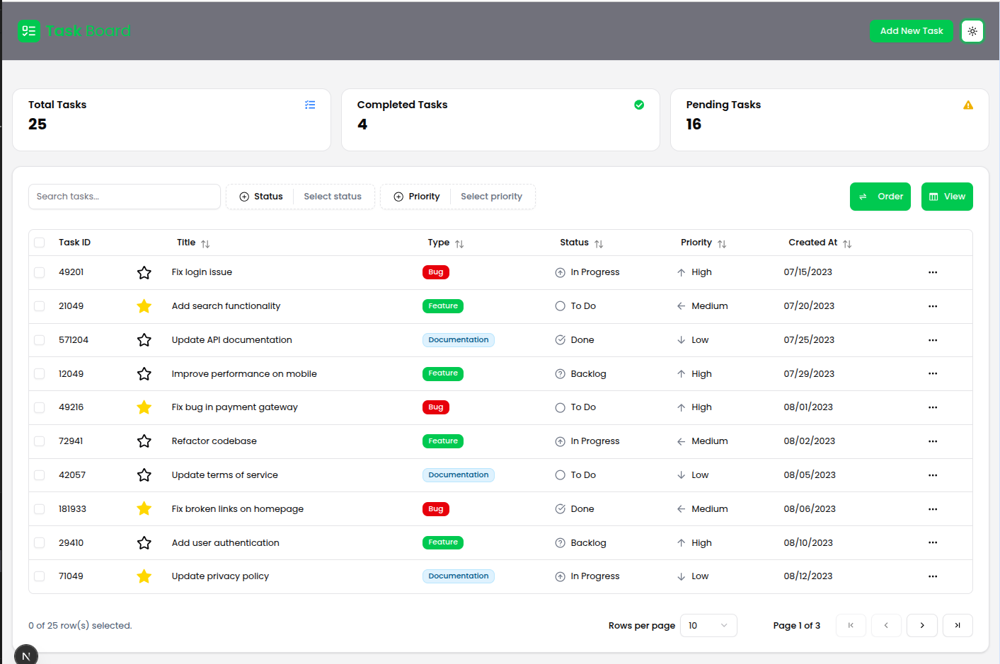
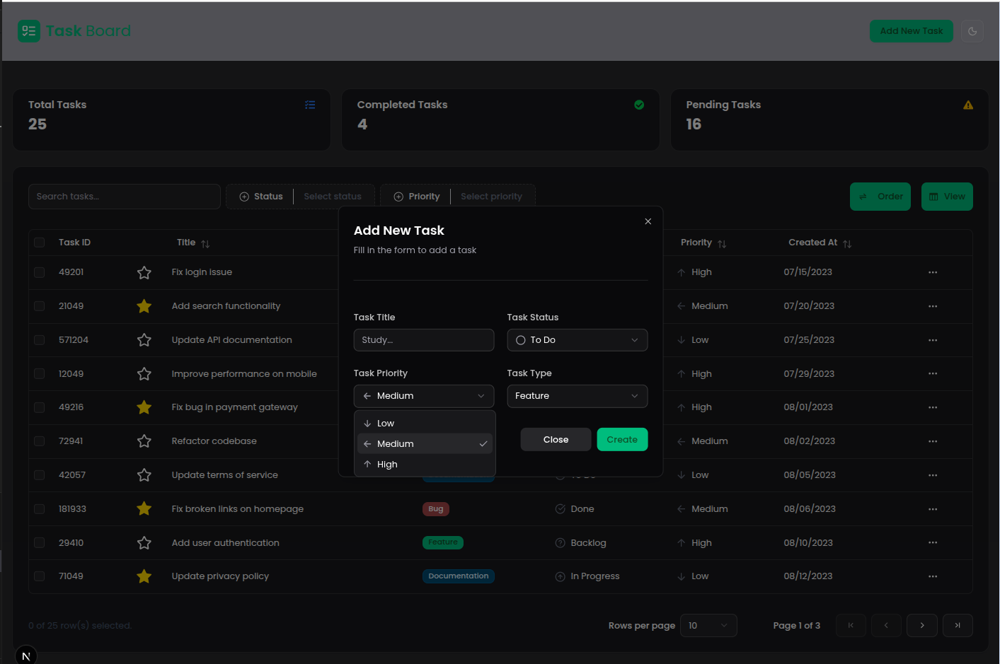
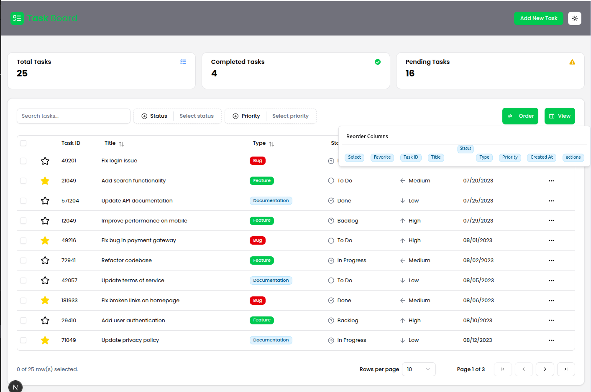
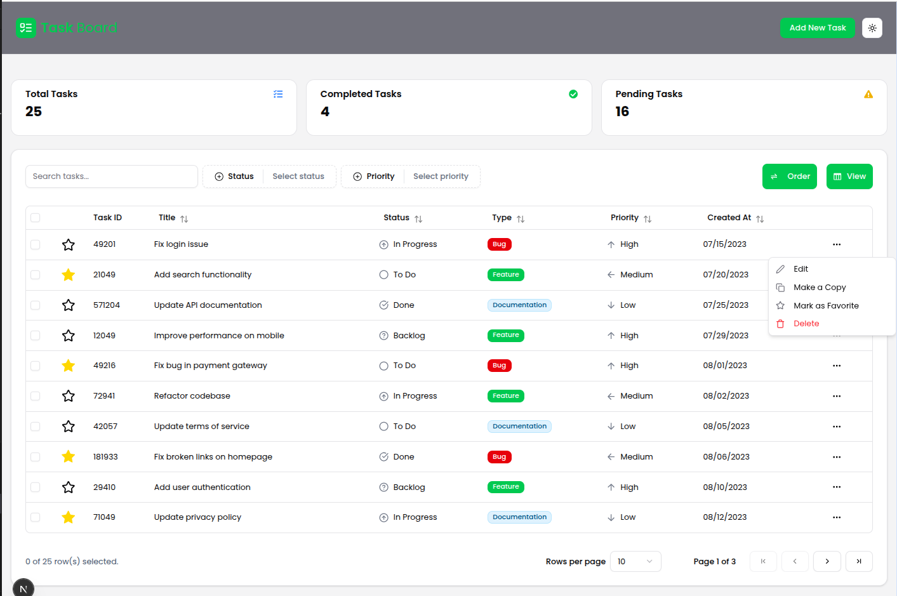

	<h1>📝 Task Manager — Training Project</h1>
	

		<b>Task manager</b> for practicing with <a href="https://tanstack.com/table/v8">TanStack Table</a> and a modern React stack.
	

---

## 📋 Description

This project is a training task manager app, created to practice working with <b>TanStack Table</b> (v8) and modern frontend tools. The main goal is to try out the TanStack Table API in real scenarios and implement common table features.

---

## 🚀 Features

- 🔍 <b>Search</b>
- 🎯 <b>Filtering</b>
- ↕️ <b>Sorting</b>
- 📄 <b>Pagination</b>
- 👁️ <b>Column visibility management</b>
- 🟰 <b>Drag & Drop</b> — reorder columns
- ➕ <b>Create/edit/delete tasks</b>

---

## 🛠️ Technologies

- <b>Next.js</b> + <b>TypeScript</b>
- <b>TanStack Table v8</b>
- <b>React Hook Form</b> + <b>Zod</b> (form validation)
- <b>shadcn/ui</b> (UI components)

---

	<b>This project was created for practice and experiments with modern frontend tools!</b>

## 🖼️ Screenshots

